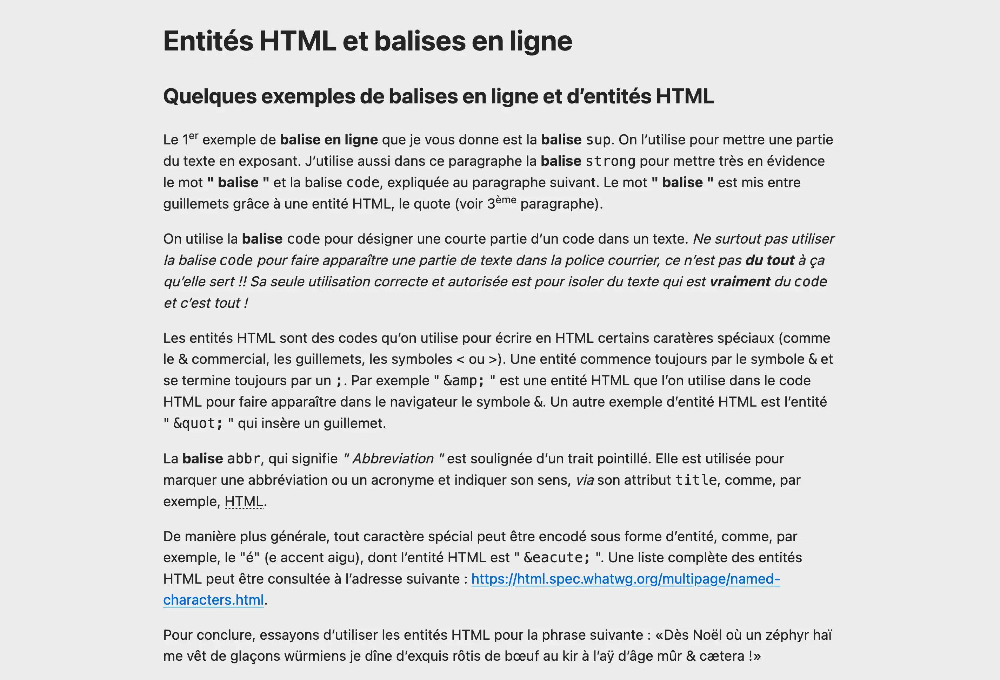

# HTML "Entities"

> HTML exercise about entities & special characters

* * *

**HTML "Entities"** is an educational project, which will be used for `HTML`/`CSS` courses.

**Note:** the school where the course is given, the [HEPL](http://www.hepl.be) from Liège, Belgium, is a french-speaking school. From this point, the instruction will be in french. Sorry.

* * *

## Quelques exemples de balises en ligne et d’entités `HTML`

1. Ouvrez le fichier [index.txt](./assets-starter/index.txt)
2. Renommez le **index.html** et organisez votre dossier comme enseigné au cours
3. Ajoutez le code `HTML` nécéssaire pour structurer le document.

Vous le savez, quand vous paramétrez bien votre éditeur de code pour qu’il encode ce que vous écrivez en utf-8 et que vous annoncez au navigateur que c’est utf-8 le jeu de caractères avec lequel il doit décoder la page qu’il reçoit, on n’a pas forcément besoin d’encoder les caractères __spéciaux__.  

Dans cet exercice qui traite essentiellement des entités, vous allez écrire le texte de la manière la plus __safe__ qui soit. Le but est de remplacer tous les caractères spéciaux par leur entité HTML de manière à vous les mettre en tête.

Le rendu final devrait apparaître comme suit dans le navigateur :

