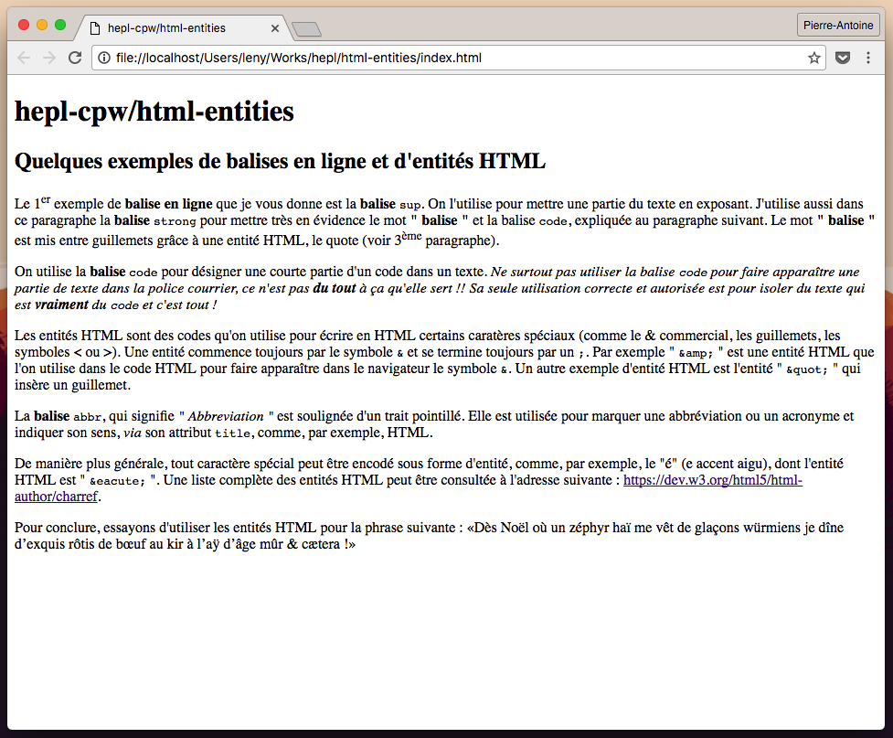

# HTML "Entities"

> HTML exercise about entities & special characters

* * *

**HTML "Entities"** is an educational project, which will be used for `HTML`/`CSS` courses.

**Note:** the school where the course is given, the [HEPL](http://www.provincedeliege.be/hauteecole) from Liège, Belgium, is a french-speaking school. From this point, the instruction will be in french. Sorry.

* * *

## Quelques exemples de balises en ligne et d'entités `HTML`

1. Ouvrez le fichier [index.txt](./index.txt)
2. Renommez le **index.html**
3. Ajoutez le code `HTML` nécéssaire pour structurer le document.

Le code final devrait apparaître comme suit dans le navigateur :

